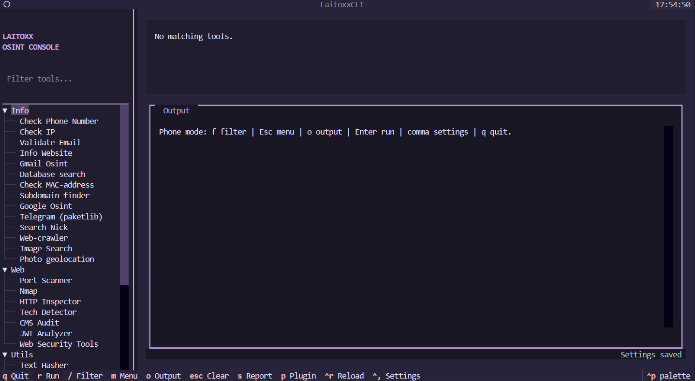
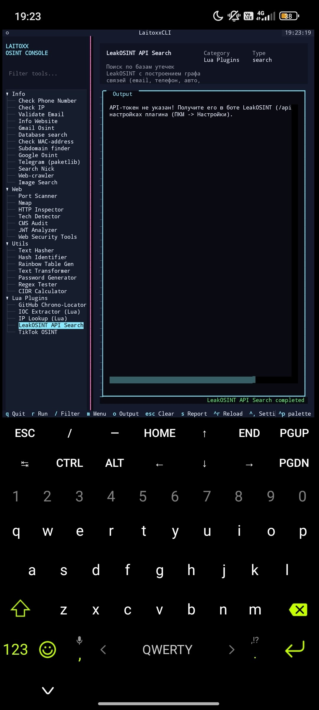

<p align="center">
  
</p>

<h1 align="center">Laitoxx Multi-Tool TUI</h1>

<p align="center">
  <b>OSINT & Cybersecurity Toolkit · Terminal-first · Python 3.13 · Textual</b>
</p>

<p align="center">
  
  
  
  
</p>

---

## 🇬🇧

### What is this?

Laitoxx Multi-Tool TUI is a terminal-based OSINT and cybersecurity toolkit built on Python 3.13 and [Textual](https://textual.textualize.io/). It runs anywhere a modern terminal is available — Linux, Windows Terminal, WSL, SSH, and native Termux on Android. The primary interface is launched with a single command:

```bash
python cli.py
```

### 🛠️ Features

#### 🔍 OSINT
| Tool | Description |
|---|---|
| **IP Info** | Geolocation, ASN, ISP, abuse contacts |
| **Phone Search** | Carrier, country, timezone, VK/Avito/web links |
| **Email Validator** | MX records, SMTP checks, reputation |
| **Username OSINT** | Cross-platform username search across 500+ sites, avatar download, nickname variants, digital portrait |
| **Gmail OSINT** | Account recovery information, linked services |
| **Google OSINT** | Dork-based search queries |
| **Telegram Search** | Username and phone search via Telegram API |
| **Image Search** | Reverse image search across engines |
| **Data Search** | Aggregate search across multiple open sources |
| **DB Searcher** | Search local breach databases |
| **User Search by Phone** | Phone → social media cross-reference |

#### 🌐 Web & Network
| Tool | Description |
|---|---|
| **HTTP Inspector** | Headers, cookies, redirects, security headers analysis |
| **Website Info** | WHOIS, DNS, server fingerprint |
| **Subdomain Finder** | Passive and active subdomain enumeration |
| **Tech Detector** | CMS, frameworks, libraries detection |
| **CMS Audit** | WordPress/Joomla/Drupal vulnerability checks |
| **Web Crawler** | Link extraction and site mapping |
| **Web Security Tools** | XSS, SQLi, open redirect scanner |
| **Port Scanner** | Fast async TCP port scanner |
| **Nmap Scanner** | Full nmap integration with XML parsing and profiles |
| **CIDR Calculator** | Subnet math, broadcast, range |
| **MAC Lookup** | OUI vendor database lookup |

#### 🔐 Crypto & Utilities
| Tool | Description |
|---|---|
| **Hash Identifier** | Detect hash type by signature |
| **Text Hasher** | MD5, SHA-1/256/512, bcrypt and more |
| **Rainbow Table Generator** | Generate hash:plaintext tables |
| **JWT Analyzer** | Decode, inspect and detect JWT vulnerabilities |
| **Password Generator** | Entropy-based password/passphrase generator |
| **Regex Tester** | Interactive regex sandbox |
| **Text Transformer** | Base64, URL encode, hex, ROT13, etc. |

#### 📸 Photo Geolocation
Two modes for locating where a photo was taken:
- **Netryx Astra** — local/community indexes with Street View coverage. Build your own index or download community packs.
- **GeoCLIP / PlaNet-like** — worldwide AI prediction, no reference index needed.

Both run in a background worker process — the TUI stays responsive during heavy AI jobs.

#### 🧩 Lua Plugin System
Extend the tool with custom Lua scripts. Plugins are discovered automatically on startup, have sandboxed file access, proxy-aware HTTP helpers, and can generate graph reports. See [`docs/guides/plugin-building.md`](./docs/guides/plugin-building.md).

Built-in plugins:
- **LeakOSINT Search** — query the LeakOSINT API and build link graphs
- **IP Lookup** — enriched IP info with graph output
- **TikTok** — profile scrape
- **IOC Extractor** — extract indicators of compromise from text
- **GitHub Chrono Locator** — locate developers by commit timezone patterns

#### ⚙️ TUI Interface
- Keyboard navigation with a command palette (`Ctrl+P`)
- Live tool filter (`/` or `f`)
- 17 built-in themes (Dracula, Nord, Cyberpunk, Matrix, and more)
- Proxy settings — HTTP, HTTPS, SOCKS5 — from the settings window
- HTML report export for any tool result
- Localization: 🇬🇧 English / 🇷🇺 Russian

---

### 📦 Installation

#### 🐧 Debian / Ubuntu / Kali

```bash
git clone https://github.com/BadPrivacyclub/Laitoxx-Multi-Tool-TUI.git
cd Laitoxx-Multi-Tool-TUI
bash install-debian.sh
source .venv/bin/activate
python cli.py
```

Or with the unified installer:

```bash
python3 install.py
source .venv/bin/activate
python cli.py
```

Install nmap separately:
```bash
sudo apt install nmap
```

---

#### 📱 Termux (Android)

<p align="center">
  
</p>

Laitoxx runs natively in Termux — no proot, no emulation needed for the core tools.

```bash
pkg update && pkg install git python nmap
git clone https://github.com/BadPrivacyclub/Laitoxx-Multi-Tool-TUI.git
cd Laitoxx-Multi-Tool-TUI
bash install-termux.sh
source .venv/bin/activate
python cli.py
```

> Photo Geolocation with PyTorch requires TUR packages or a proot Debian environment.  
> Run `PHOTO2GEO_TORCH=tur bash install-termux.sh` to use TUR.

---

#### 🪟 Windows

```bat
git clone https://github.com/BadPrivacyclub/Laitoxx-Multi-Tool-TUI.git
cd Laitoxx-Multi-Tool-TUI
install.bat
.venv\Scripts\activate.bat
python cli.py
```

Install nmap from [nmap.org](https://nmap.org/download.html) and add it to `PATH`.

---

#### 🍎 macOS / Other Unix

```bash
git clone https://github.com/BadPrivacyclub/Laitoxx-Multi-Tool-TUI.git
cd Laitoxx-Multi-Tool-TUI
bash install.sh
source .venv/bin/activate
python cli.py
```

---

#### Optional: Photo Geolocation (GeoCLIP)

```bash
python -m pip install -r requirements-photo2geo-geoclip.txt
```

Or pass `--install-planet` to the unified installer:
```bash
python install.py --install-planet
```

---

### ⌨️ Keyboard Shortcuts

| Key | Action |
|---|---|
| `/` or `f` | Focus tool filter |
| `m` | Focus tool menu |
| `Enter` / `r` | Run selected tool |
| `o` | Focus output |
| `s` | Save HTML report |
| `,` or `Ctrl+,` | Open settings |
| `Ctrl+P` | Command palette |
| `q` | Quit |

---

### ⚠️ Disclaimer

Use this software only for education, security research, CTF challenges, and systems you are authorized to test. The authors take no responsibility for misuse or unauthorized activity.

---

## 🇷🇺

### Что это?

Laitoxx Multi-Tool TUI — это консольный инструмент для OSINT и кибербезопасности, построенный на Python 3.13 и [Textual](https://textual.textualize.io/). Работает везде, где есть современный терминал — Linux, Windows Terminal, WSL, SSH и нативный Termux на Android. Запуск одной командой:

```bash
python cli.py
```

### 🛠️ Функциональность

#### 🔍 OSINT
| Инструмент | Описание |
|---|---|
| **IP Info** | Геолокация, ASN, ISP, контакты abuse |
| **Поиск по номеру** | Оператор, страна, часовой пояс, ссылки VK/Avito |
| **Email Validator** | MX-записи, SMTP-проверки, репутация |
| **Username OSINT** | Поиск никнейма на 500+ сайтах, скачивание аватаров, генератор вариантов, цифровой портрет |
| **Gmail OSINT** | Информация о восстановлении аккаунта и связанных сервисах |
| **Google OSINT** | Поисковые запросы на основе дорков |
| **Telegram Search** | Поиск по нику и номеру через Telegram API |
| **Image Search** | Обратный поиск изображений по нескольким движкам |
| **Data Search** | Агрегированный поиск по открытым источникам |
| **DB Searcher** | Поиск по локальным базам утечек |
| **Поиск по телефону** | Телефон → кросс-поиск по соцсетям |

#### 🌐 Сеть и веб
| Инструмент | Описание |
|---|---|
| **HTTP Inspector** | Заголовки, куки, редиректы, анализ security-заголовков |
| **Website Info** | WHOIS, DNS, отпечаток сервера |
| **Subdomain Finder** | Пассивный и активный поиск поддоменов |
| **Tech Detector** | Определение CMS, фреймворков и библиотек |
| **CMS Audit** | Проверка уязвимостей WordPress / Joomla / Drupal |
| **Web Crawler** | Извлечение ссылок и картография сайта |
| **Web Security Tools** | Сканер XSS, SQLi, open redirect |
| **Port Scanner** | Быстрый асинхронный TCP-сканер портов |
| **Nmap Scanner** | Полная интеграция nmap с парсингом XML и профилями |
| **CIDR Calculator** | Подсети, broadcast, диапазоны |
| **MAC Lookup** | Поиск вендора по OUI базе |

#### 🔐 Крипто и утилиты
| Инструмент | Описание |
|---|---|
| **Hash Identifier** | Определение типа хэша по сигнатуре |
| **Text Hasher** | MD5, SHA-1/256/512, bcrypt и другие |
| **Rainbow Table Generator** | Генерация таблиц хэш:текст |
| **JWT Analyzer** | Декодирование, инспекция и поиск уязвимостей JWT |
| **Password Generator** | Генератор паролей и парольных фраз на основе энтропии |
| **Regex Tester** | Интерактивная sandbox для регулярных выражений |
| **Text Transformer** | Base64, URL encode, hex, ROT13 и другие |

#### 📸 Геолокация по фото
Два режима определения места съёмки фотографии:
- **Netryx Astra** — локальные и community-индексы на основе Street View. Можно строить свой индекс или скачивать готовые паки.
- **GeoCLIP / PlaNet-like** — глобальное AI-предсказание без опорного индекса.

Оба режима работают в фоновом процессе — TUI остаётся отзывчивым во время тяжёлых вычислений.

#### 🧩 Lua-плагины
Расширяйте инструментарий своими Lua-скриптами. Плагины обнаруживаются автоматически, имеют песочницу для файлового доступа и прокси-aware HTTP-хелперы, умеют строить граф-отчёты. Документация: [`docs/guides/plugin-building.md`](./docs/guides/plugin-building.md).

Встроенные плагины:
- **LeakOSINT Search** — запросы к LeakOSINT API и построение граф-связей
- **IP Lookup** — расширенная информация об IP с графом
- **TikTok** — сбор данных профиля
- **IOC Extractor** — извлечение индикаторов компрометации из текста
- **GitHub Chrono Locator** — определение локации разработчика по временным паттернам коммитов

#### ⚙️ TUI-интерфейс
- Навигация с клавиатуры, командная палитра (`Ctrl+P`)
- Живой фильтр инструментов (`/` или `f`)
- 17 встроенных тем (Dracula, Nord, Cyberpunk, Matrix и другие)
- Прокси — HTTP, HTTPS, SOCKS5 — из окна настроек
- Экспорт результатов в HTML-отчёт
- Локализация: 🇬🇧 English / 🇷🇺 Русский

---

### 📦 Установка

#### 🐧 Debian / Ubuntu / Kali

```bash
git clone https://github.com/BadPrivacyclub/Laitoxx-Multi-Tool-TUI.git
cd Laitoxx-Multi-Tool-TUI
bash install-debian.sh
source .venv/bin/activate
python cli.py
```

Или через универсальный установщик:

```bash
python3 install.py
source .venv/bin/activate
python cli.py
```

Установить nmap:
```bash
sudo apt install nmap
```

---

#### 📱 Termux (Android)

<p align="center">
  
</p>

Laitoxx работает нативно в Termux — proot и эмуляция не нужны для основных инструментов.

```bash
pkg update && pkg install git python nmap
git clone https://github.com/BadPrivacyclub/Laitoxx-Multi-Tool-TUI.git
cd Laitoxx-Multi-Tool-TUI
bash install-termux.sh
source .venv/bin/activate
python cli.py
```

> Геолокация по фото с PyTorch требует TUR-пакеты или proot Debian.  
> Запустите `PHOTO2GEO_TORCH=tur bash install-termux.sh` для установки через TUR.

---

#### 🪟 Windows

```bat
git clone https://github.com/BadPrivacyclub/Laitoxx-Multi-Tool-TUI.git
cd Laitoxx-Multi-Tool-TUI
install.bat
.venv\Scripts\activate.bat
python cli.py
```

Установить nmap с [nmap.org](https://nmap.org/download.html) и добавить в `PATH`.

---

#### 🍎 macOS / Другие Unix

```bash
git clone https://github.com/BadPrivacyclub/Laitoxx-Multi-Tool-TUI.git
cd Laitoxx-Multi-Tool-TUI
bash install.sh
source .venv/bin/activate
python cli.py
```

---

#### Опционально: Геолокация по фото (GeoCLIP)

```bash
python -m pip install -r requirements-photo2geo-geoclip.txt
```

Или через установщик:
```bash
python install.py --install-planet
```

---

### ⌨️ Горячие клавиши

| Клавиша | Действие |
|---|---|
| `/` или `f` | Фокус на фильтр инструментов |
| `m` | Фокус на меню инструментов |
| `Enter` / `r` | Запустить выбранный инструмент |
| `o` | Фокус на вывод |
| `s` | Сохранить HTML-отчёт |
| `,` или `Ctrl+,` | Открыть настройки |
| `Ctrl+P` | Командная палитра |
| `q` | Выход |

---

### ⚠️ Дисклеймер

Используйте этот инструмент только в образовательных целях, для исследований безопасности, CTF-соревнований и систем, которые вы уполномочены тестировать. Авторы не несут ответственности за неправомерное использование.
