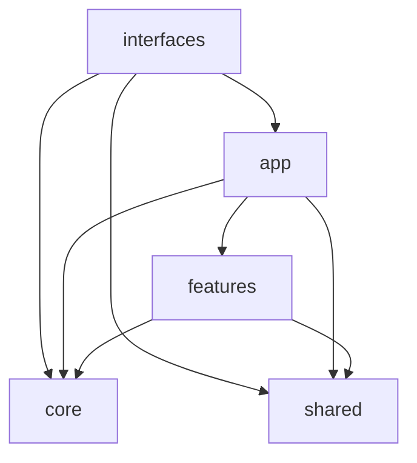

# Architecture Rules

Laitoxx uses a Python feature-based architecture with an explicit application
composition layer.

```text
src/laitoxx/
├── app/          # composition: tool registry, plugin runtime wiring
├── core/         # settings, config, localization, install orchestration
├── features/     # domain tools grouped by feature area
├── interfaces/   # CLI, TUI and GUI adapters
└── shared/       # reusable models and helper code
```

## Dependency Direction

Allowed:

- `interfaces -> app`
- `interfaces -> core`
- `interfaces -> shared`
- `app -> features`
- `app -> core`
- `app -> shared`
- `features -> core`
- `features -> shared`

Forbidden:

- feature-to-feature imports, except inside the same feature package;
- importing old root packages such as `gui`, `tui`, `settings`, `script`,
  `lua_engine`, `plugin_builder`, `i18n`;
- resolving project files through the current working directory.

Project files must be resolved through `laitoxx.core.settings.paths`.

## Feature Layout

Current feature groups:

- `features/osint`
- `features/network`
- `features/web_audit`
- `features/crypto`
- `features/photo_geolocation`
- `features/utilities`

New domain code goes into the closest feature package. If the code is reused by
two or more feature groups, move it to `shared/`. If the code configures the
whole application, move it to `core/`. If the code only renders or collects user
input, move it to `interfaces/`.

## Naming

- classes: `PascalCase`;
- functions and variables: `snake_case`;
- constants: `UPPER_SNAKE_CASE`;
- Python modules: `snake_case.py`;
- documentation files: `kebab-case.md`;
- generated/runtime data: `config/`, `resources/`, `reports/`, not `src/`.

## Import Examples

```python
from laitoxx.features.network.ip_info import get_ip
from laitoxx.core.settings.paths import ROOT_DIR
from laitoxx.shared.graph.model import Graph
```

Avoid:

```python
from script.tools.ip_info import get_ip
from gui.tool_registry import TOOL_REGISTRY
```

## Architecture Diagram



## Enforcement

Run:

```bash
python scripts/check-structure.py
python -m compileall -q src tests laitoxx cli.py gui.py install.py
```

Large legacy files are tracked in `docs/architecture/audit.md`. They are allowed
only as a migration baseline; new large files should be split before merge.
